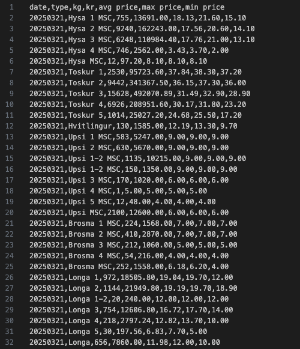
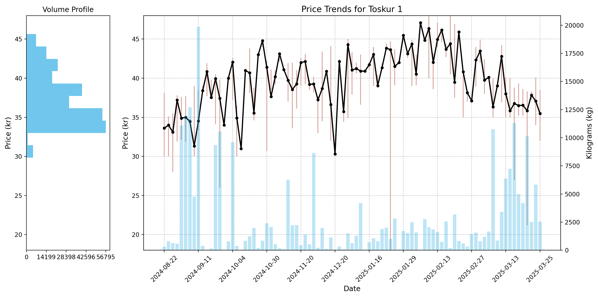

# FMFO

The project contains data that has been scraped from [Faroe Fish Market](https://fmf.fo/), and compiled into csv files by year. 

Included in the project is a python script that allows the user to analyze the compiled data.

## Overview
| CSV Data | Python Script | 
| :---:   | :---: |
|  | 

## Usage

### Prerequisites
The script relies on the following Python libraries:

`pandas`: Data manipulation and analysis.

`matplotlib`: Plotting data on chart.

`numpy`: Used for numerical operations.

#### Install the required libraries:
you can install all the dependencies from the **requirements.txt** file using the following command:
```
pip install -r requirements.txt
```

### Running the script

Execute the command
```
python fmf.py --price
```

The script will prompt you for an item to plot
```
Enter the type to plot (default: 'Hysa 1 MSC'): [INPUT YOUR ITEM HERE, ex : Toskur 1]
```
After the item, the script will ask for a year
```
Enter the year to plot (default: '2025'): 
```
Finally, the script will ask for volume profile, if it should be activated or not
```
Show Volume Profile Y / N (Default: Y)
```
Script will start to analyze the data based on the input given
```
Plotting data for: Toskur 1, years 2025, volume profile: True
```


---
<br/>

### Listing Available Types

To display all available **types**, run:

```
python fmf.py --listall
```
and the script will output all **unique** types
```
Available types:
Hysa 1 MSC
Hysa 2 MSC
Hysa 3 MSC
Hysa 4 MSC
Hysa MSC
Toskur 1
Toskur 2
Toskur 3
Toskur 4
Toskur 5
Hvitlingur
Upsi 1 MSC
Upsi 2 MSC
Upsi 1-2 MSC
Upsi 3 MSC
Upsi 4 MSC
Upsi 5 MSC
.....
```